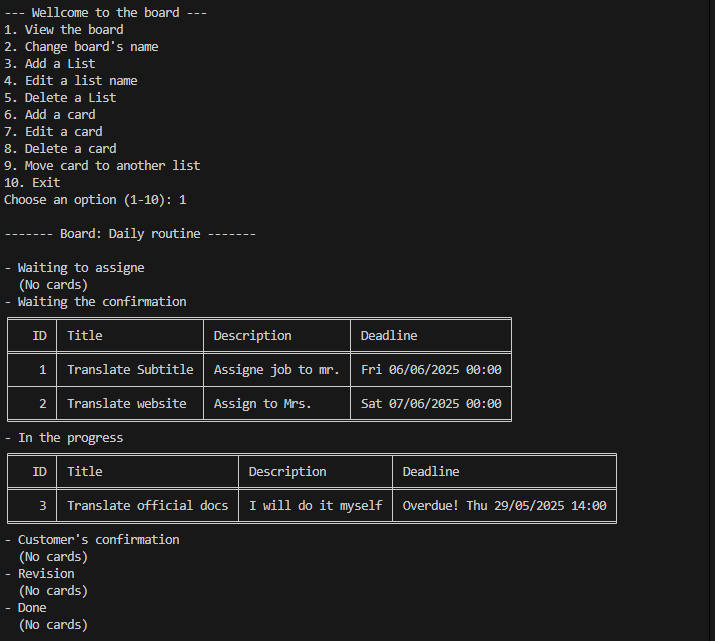

# Task management Board

This is a task management board written in Python. You can create task lists (like "To Do", "In Progress", "Done") and add/edit/move cards within those lists — similar to Trello, but entirely in your terminal.

---

## Features

- Add, edit, and delete task lists
- Add, edit, move, and delete cards
- Set deadlines for each card
- Save and load board data using JSON
- Clean terminal display using `tabulate`
- Includes unit tests for all core features

---
## Screenshots

### CLI Interface


### Board View with Cards


## Requirements

Make sure you have Python 3.10+ installed.  
> Tip: It’s recommended to use a virtual environment.

```bash
# Create and activate a virtual environment (optional)
python -m venv myenv
# Windows
.\myenv\Scripts\Activate.ps1
# macOS/Linux
source myenv/bin/activate
```
Then install the required packages using:

```bash
pip install -r requirements.txt
```
---

## How to Run

```bash
python main.py
```

This will launch the interactive menu in your terminal.

---

## 📁 Project Structure

```
myenvironment/
├── requirements.txt
├── board_data.json           # Automatically saved state
├── README.md
├── src/
│   ├── Board.py
│   ├── Card.py
│   └── main.py
│   └── TaskList.py
├── tests/
│   ├── test_Board.py
│   ├── test_Card.py
│   └── test_TaskList.py
```

---

## Running Tests

Tests are written using `pytest`.

```bash
pytest
```

---

## Notes

- Uses JSON for data persistence (`board_data.json`)
- `tabulate` is used to format board/card tables
- Project is organized using object-oriented design


## Acknowledgements

- This project was developed using Python and external libraries including `tabulate`, `pytest`, etc.
- AI assistance (ChatGPT) was used to:
  - Help debug and refactor code
  - Clarify Python concepts
  - Guide project structure and unit testing
- Online resources consulted:
  - [Python documentation](https://docs.python.org/3/)
  - [Tabulate documentation](https://pypi.org/project/tabulate/)
  - [GeeksforGeeks Python Tutorials](https://www.geeksforgeeks.org/)
  - [W3Schools Python Guide](https://www.w3schools.com/python/)


